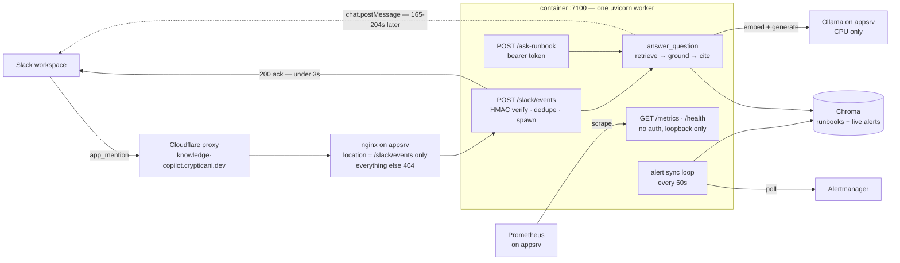

# Service: Knowledge Copilot

A RAG service that answers ops questions — "what's the usual fix for X" — over runbooks,
postmortems, and live infra signals, with citations back to the source document.

This is **Project 2 (Week 2)** of the [30-day AI-Native DevOps challenge](../../docs/ai-devops-30-day-challenge.md) — complete, Days 8–14.

> New to embeddings and vector search? [**docs/knowledge-copilot.md**](../../docs/knowledge-copilot.md)
> explains the concepts from the ground up and walks through what every part of the code is doing
> and why. This README is the *what and how much*; that one is the *why*.

**Status (through Day 14 — final):** the service is live in production, answering in Slack
threads, and now says what it is doing while it does it. `GET /metrics` exposes answer
outcomes, per-stage latency and the retrieval-similarity distribution to Prometheus, with a
Grafana dashboard built on them. `POST /ask-runbook` takes a bearer token. The similarity floor
is no longer a guess — it was **measured** at 0.64, and the measurement overturned the
assumption that had been sitting in the backlog. See [Day 14](#day-14--metrics-auth-and-a-measured-floor).

## How it fits together



The dashed arrow is the whole trick. Slack allows **3 seconds** to acknowledge an event, and a
grounded answer takes **165–204 seconds** on CPU. So the ack and the answer are two separate
HTTP conversations travelling in opposite directions: the inbound one is authenticated by
Slack's HMAC signature, the outbound one by the bot token. Everything below is the detail.

**Status (through Day 12):** the index is no longer just a corpus. Alongside eleven runbooks and
postmortems it now holds **live Alertmanager alerts**, synced every 60 seconds by a background
task, retained 24 hours after they resolve. Ask *"is the disk filling up right now?"* and
retrieval returns the firing alert ahead of the runbook that explains it, and the answer cites
both separately. What made this a day's work rather than an afternoon's is that live data broke
two assumptions the static-corpus design was resting on — see [Day 12](#day-12--live-infra-data-connectorsalertmanagerpy).

**Status (through Day 10):** the service answers questions over HTTP and cites what it used.
Text becomes vectors, vectors go into Chroma, `ingest.py` reconciles the index to the corpus on
every run (add / update / delete / skip), and `POST /ask-runbook` retrieves the top-k chunks,
builds a context-augmented prompt, and validates every citation the model emits against the
chunks that were actually retrieved. When retrieval comes back weak the endpoint refuses instead
of answering from pretraining. Retrieval *quality* — hybrid search, reranking, a real eval set —
is Day 11; what exists now is a defensible grounding contract, because a RAG service that
answers confidently from nothing is worse than one that says it doesn't know.

## Architecture (as of Day 11)

```text
corpus/*.md ──▶ load_corpus() ──▶ chunk_corpus(512, 64) ──▶ BaseEmbeddingProvider ──┬──▶ OllamaEmbeddingProvider  (nomic-embed-text)
 (front matter    (chunking.py)     (word-boundary windows,     (embeddings.py)      └──▶ GeminiEmbeddingProvider (gemini-embedding-001)
  + markdown)                        stable {slug}:{i} IDs)              │
                                            │                            ▼
                              content_hash per doc          Chroma collection (cosine space)
                                            │                     ▲            │
                     ingest.py: plan_reconcile(desired, existing) ┘            │
                     add / update / delete / skip  (idempotent)                │
                                                                               │
POST /ask-runbook ──▶ retrieve() ──▶ embed_query() ─────────────────────────────▶ dense pool of 15 (HNSW)
   (app.py)          (retrieval.py)      │                                                   │
                                         │        bm25_scores() over the cached index ──▶ lexical pool of 15
                                         │                    (hybrid.py)                    │
                                         │                                    rrf() fuses the two rankings
                                         │                                                   │
                                         │                     score = 1 - distance, drop < 0.65
                                         ▼                     (cosine, never the fused score)
                     nothing cleared the floor? ──▶ refuse, no LLM call ◀────────────────────┘
                                         │                                        top k=4
                     build_context() ──▶ <chunk id="n"> blocks ──▶ BaseLLMProvider ──┬──▶ OllamaProvider  (qwen2.5:7b-instruct)
                                         │                            (llm.py)       └──▶ GeminiProvider  (gemini-3.6-flash)
                                         ▼
                     ground_answer() ──▶ markers vs retrieved set ──▶ AskResponse{answer, sources, grounded, answer_source}
```

**Modules, each with one job:**

1. **`chunking.py`** — turns the corpus into identified, embeddable pieces. Pure functions, no
   network, no Chroma. Unit-tested.
2. **`embeddings.py`** — the text-to-vector boundary. A `BaseEmbeddingProvider` ABC with two
   backends, mirroring the `BaseLLMProvider` Strategy pattern from the log analyzer. Nothing
   downstream knows which model produced a vector.
3. **`ingest.py`** (Day 9) — the durable ingestion pipeline. Reconciles the Chroma index to the
   corpus idempotently (add / update / delete / skip via a per-doc `content_hash`).
   `plan_reconcile` is a pure, unit-tested function.
4. **`retrieval.py`** (Day 10, extended Day 11) — question to ranked chunks: embed the query,
   build a candidate pool from dense and lexical rankings, fuse them, drop everything below the
   floor, return text *and* metadata. No LLM, no FastAPI.
5. **`hybrid.py`** (Day 11) — BM25, Reciprocal Rank Fusion, and MMR as pure functions over text
   and vectors. No I/O at all, which is why its tests need neither Chroma nor a network.
6. **`llm.py`** (Day 10) — the text-generation boundary. A second `BaseLLMProvider` ABC whose
   `generate()` returns a plain `str`, and an `UpstreamError` carrying the HTTP status its
   failure should become.
7. **`app.py`** (Day 10) — FastAPI. Prompt assembly, citation validation, `POST /ask-runbook`,
   `GET /health`. The grounding logic inside it is pure functions over strings.
8. **`day8_embeddings.py`** — the Day 8 experiment. Indexes the corpus at three chunk sizes and
   compares retrieval across them. A dated artifact, not a service entrypoint.
9. **`eval_retrieval.py`** (Day 11) — the retrieval quality sweep over `eval_set.json`. Never
   calls the generator, so the whole grid runs in seconds rather than 195s per answer.
10. **`connectors/alertmanager.py`** (Day 12) — Alertmanager as a second document source.
    Exactly one function does I/O (`fetch_alerts`); rendering and the resolved/expiry diff are
    pure, which is why retention is tested against a recorded payload with no network and no
    database. It returns `list[Document]` — the same type `load_corpus()` returns — so a
    connector is a producer, not a parallel pipeline.

## Design decisions worth defending

### Documents and queries get separate embedding methods

`embed_documents()` and `embed_query()` are two methods on the interface, not one `embed()`.
Both backends want to know which side of a search a piece of text is on — nomic uses a
`search_document:` / `search_query:` prefix, Gemini uses `task_type=RETRIEVAL_DOCUMENT` vs
`RETRIEVAL_QUERY` — because a question and the passage that answers it are not the same shape
of text. Embedding both identically is a real and common retrieval bug that never raises an
error; it just quietly costs accuracy. Two methods make it impossible to do by accident.

### Cosine space, set explicitly

Chroma defaults to squared L2. The collections here are created with
`configuration={"hnsw": {"space": "cosine"}}` because we care about *direction* — what a chunk
is about — not magnitude, which under L2 would let a longer chunk score differently for
reasons that have nothing to do with meaning. Every vector is L2-normalized on the way out of
the provider, which is also what lets the intuition check compute cosine similarity as a plain
dot product. Chroma returns cosine **distance**, so the reported score is `1 - distance`.

### We supply our own vectors

Collections are created with `embedding_function=None`. Left at its default, Chroma would
download and run its own ONNX MiniLM model — a second, invisible embedding model silently
competing with the one we configured. An index built by a different model than the one
embedding the queries produces plausible-looking garbage, which is the worst failure mode
available here.

### Chunk IDs are `{slug}:{index}`, not UUIDs

Deterministic IDs mean re-running the indexer upserts over the same rows instead of
duplicating them. That is the hook Day 9's idempotent re-index hangs on. Caveat: the same ID
means *different text* under a different `(size, overlap)`, which is safe today only because
each config gets its own collection.

### The chunker is hand-written

No LangChain splitter. Windows snap backwards to the nearest space so words are never cut in
half — a fragment like `OOMKil` is noise the model still folds into the vector. Windows
overlap so a fact straddling a boundary lands intact in at least one chunk. Both behaviours
are tested, because a chunker that silently stops overlapping doesn't crash; it just degrades
retrieval weeks later.

### The provider factory raises instead of falling back

`get_embedding_provider()` raises on an unknown `EMBEDDING_PROVIDER`, where the log analyzer's
equivalent logs an error and defaults to Ollama. With embeddings a silent fallback is worse
than a crash: a corpus indexed by an unintended model looks like it worked. Worth back-porting
to the log analyzer.

## The corpus

Eleven documents in [`corpus/`](./corpus), with front matter
(`title`, `service`, `doc_type`, `last_reviewed`) that becomes chunk metadata:

| Document | `service` | `doc_type` | Failure domain |
|---|---|---|---|
| `oomkilled-pod.md` | `platform` | `runbook` | Memory limit exceeded, exit code 137 |
| `crashloopbackoff.md` | `platform` | `runbook` | Container exits on start; reading `--previous` logs |
| `imagepullbackoff.md` | `platform` | `runbook` | Registry auth, wrong tag, rate limits |
| `node-disk-pressure.md` | `platform` | `runbook` | Kubelet eviction, image cache, inode exhaustion |
| `tls-cert-expiry.md` | `edge` | `runbook` | Expired ingress cert, cert-manager renewal failure |
| `postgres-conn-pool-exhaustion.md` | `data` | `runbook` | `too many clients already`, idle-in-transaction |
| `jenkins-agent-offline.md` | `ci` | `runbook` | Agent disconnect, workspace disk full, label mismatch |
| `coredns-resolution-failure.md` | `platform` | `runbook` | In-cluster DNS, `ndots:5`, CoreDNS OOM |
| `postmortem-2026-06-checkout-oom-outage.md` | `platform` | `postmortem` | Checkout OOM loop after an unbounded cache release |
| `postmortem-2026-07-ingress-tls-expiry.md` | `edge` | `postmortem` | Silent cert-manager renewal failure, then expiry |
| `reference-pod-resource-limits.md` | `platform` | `reference` | Requests vs limits, QoS classes, memory sizing |

The first eight were all `doc_type: runbook` deliberately — for the Day 8 experiment the only
variable should be chunk size. **Day 9 added the two postmortems and the reference doc**, which
is when `doc_type` becomes worth filtering on. They also overlap existing runbook topics on
purpose (checkout-OOM ↔ `oomkilled-pod`, TLS-expiry ↔ `tls-cert-expiry`), giving the Day 11
eval the topically-competing documents the original disjoint set lacked.

The retrieval questions in [`queries.json`](./queries.json) were written separately from the
corpus, without rereading it. That matters: if one author phrases both, a query matches its
runbook because of shared vocabulary habits, and the test proves nothing. The point is to
watch a 2am symptom description find a document that never uses those words — which is the
entire argument for embeddings over grep.

## Running it

```bash
pip install -r requirements.txt
python ingest.py                 # build or reconcile the index
uvicorn app:app --port 7100      # serve /ask-runbook and /health

curl -s localhost:7100/ask-runbook -H 'content-type: application/json' \
  -d '{"question":"why do my pods get OOMKilled after a deploy"}'
```

Requires two models on the configured Ollama host — one to embed, one to write prose:

```bash
ollama pull nomic-embed-text     # 768-dim, ~274MB
ollama pull qwen2.5:7b-instruct  # generation, ~4.7GB
```

Day 11's retrieval sweep runs without the generator, so it costs seconds rather than minutes:

```bash
python eval_retrieval.py --modes dense --lam 1.0    # the baseline, on its own
python eval_retrieval.py --filters                  # the full grid
python eval_retrieval.py --modes hybrid --lam 1.0 0.5 0.3
```

It prints quality and latency per configuration, plus `soft_hit@1` broken out by query kind —
which is where a technique that helps one kind and hurts another becomes visible at all.

The Day 8 experiment is still runnable on its own: `python day8_embeddings.py --reset`.

The script prints four sections: what a vector looks like and how cosine similarity separates
related from unrelated text; index construction at each chunk size; a per-query comparison of
top-3 hits across configs; and a hit@1 / hit@3 summary.

Config comes from the repo-root `.env`:

| Variable | Default | Purpose |
|---|---|---|
| `EMBEDDING_PROVIDER` | `ollama` | `ollama` or `gemini` |
| `OLLAMA_EMBED_MODEL` | `nomic-embed-text` | Embedding model — not the generation model |
| `OLLAMA_BASE_URL` | `http://localhost:11434` | Shared with the log analyzer |
| `GEMINI_EMBED_MODEL` | `gemini-embedding-001` | Pinned to 768 dims so the two are comparable |
| `CHROMA_PATH` | `services/knowledge-copilot/chroma_data` | Persistent index; gitignored, rebuildable |
| `LLM_PROVIDER` | `ollama` | Generation backend: `ollama` or `gemini` |
| `OLLAMA_CHAT_MODEL` | `qwen2.5:7b-instruct` | **Not** `OLLAMA_MODEL` — see below |
| `SIMILARITY_FLOOR` | `0.65` | Below this score a chunk is not context. Measured ~0.01 too high — see [findings](#two-failures-the-eval-found-that-are-not-ranking-problems) |
| `RETRIEVAL_MODE` | `hybrid` | `dense`, `lexical`, or `hybrid`. Day 11's eval chose the default |
| `LLM_TIMEOUT` | `300` | Seconds. 120 was not enough — see [findings](#day-10-latency-is-the-real-constraint) |
| `COPILOT_PORT` | `7100` | Only used by `python app.py`; the log analyzer owns 7000 |

`OLLAMA_CHAT_MODEL` exists because the repo-root `.env` is shared, and `OLLAMA_MODEL` already
belongs to the log analyzer — which needs a *code* model for schema-constrained JSON output.
This service needs one that writes incident prose. Two services, one `.env`, two generation
models, so two variables. `OLLAMA_EMBED_MODEL` splits the same way for the same reason.

## Day 9 — idempotent ingestion (`ingest.py`)

`day8_embeddings.py` is a dated experiment. `ingest.py` is the durable pipeline: it reconciles
the Chroma index to `corpus/` in one pass — add new chunks, re-embed changed docs, delete
orphaned chunks, skip unchanged ones. **Re-running it on an unchanged corpus embeds nothing.**

Plain `collection.upsert` is not idempotent: it replaces rows that share an ID this run, but
it never removes chunks that should no longer exist. Shrink a doc from 8 chunks to 5 and
`{slug}:5..7` are orphaned; delete a doc and *all* its chunks linger — stale, still
retrievable, and silent. Day 9 is the reconcile step that fixes that.

The hook is a per-document `content_hash` (sha256 of body **+** front matter) stored on every
chunk. Each run reads the stored hashes back and `plan_reconcile` — a pure, unit-tested
function with no Chroma or network — sorts every chunk:

```text
id absent                    -> add
id present, hash differs     -> update (re-embed)
id present, hash matches     -> skip
id in index, not in corpus   -> delete   <- the half upsert can't do
```

Production collection: `knowledge_{provider}_512_64` — renamed from the Day 8 experiment's
`runbooks_*` because the corpus now holds runbooks, postmortems, and reference docs. The name
encodes the provider and config, so an Ollama index can never be queried with Gemini vectors;
switching providers requires `--reset`.

```bash
python ingest.py --dry-run                                    # preview the plan, change nothing
python ingest.py                                              # apply
python ingest.py --reset                                      # full rebuild (to switch provider)
python ingest.py --corpus ../../docs                          # any directory of markdown
```

`--reset` and `--dry-run` are refused together, by `argparse` at the CLI edge and by a
`ValueError` inside `ingest()` for callers that skip the CLI. They are contradictory: `--reset`
drops the collection, and a dry run is defined by changing nothing. The first version put the
drop *above* the dry-run return, so `--reset --dry-run` printed a plan and silently wiped the
index — a flag whose entire contract is "safe to run" was the destructive one. Both guards
exist because Day 10's endpoint will import `ingest()` directly and never touch `argparse`.

`--corpus` points the pipeline at any directory of front-mattered markdown; it defaults to
`./corpus`. That is what makes the script *reusable* rather than merely re-runnable, and it is
also what lets the tests drive the whole pipeline against a `tmp_path` corpus.

Every chunk carries `title, service, doc_type, last_reviewed, source, chunk_index,
content_hash, indexed_at`. Day 9 exposed a `--query` / `--where` pair on the CLI for searching
against those; **Day 10 deleted both** along with `ingest.py`'s thin `search()`, because that
function's `include` list omitted `"documents"` and so could never feed a prompt. Keeping a
second, weaker retrieval implementation alive to serve a demo flag is how two code paths drift
apart. `retrieval.retrieve()` is now the only one, and `POST /ask-runbook` is its only front
door. The tradeoff is real and noted below: there is no longer an offline way to eyeball the
similarity floor, and metadata filtering has to come back as a request parameter when Day 11's
eval needs it.

`ingest()` takes an optional `provider` and `client`, defaulting to the configured ones. That
one seam is what makes the pipeline testable offline: a fake provider that counts vectors and a
throwaway Chroma path prove the guarantees end to end without a network call. Without it, the
only untested surface was `ingest()` itself — which is precisely where the `--reset --dry-run`
bug lived.

## Day 10 — `POST /ask-runbook` (`retrieval.py`, `llm.py`, `app.py`)

The endpoint is the easy half. The half worth defending is what happens when retrieval comes
back weak, and whether a citation in the prose points at a chunk that was actually retrieved.

### Contract

```
POST /ask-runbook
  question: str          min_length 10
  k: int = 4             bounded 1-10

200 ->
  answer: str
  sources: [{marker, source, chunk_index, score}]
  grounded: bool
  answer_source: "runbooks" | "none"
```

```jsonc
// curl -d '{"question":"why do my pods get OOMKilled after a deploy"}'
{
  "answer": "The pods may get OOMKilled after a deploy if the memory limit was not increased
             to accommodate higher per-request memory use. In the `checkout` service incident,
             deploying v4.19 without raising the memory limit led to an OOMKill loop [3].",
  "sources": [{"marker": 3, "source": "postmortem-2026-06-checkout-oom-outage.md",
               "chunk_index": 0, "score": 0.723}],
  "grounded": true,
  "answer_source": "runbooks"
}
```

### `grounded` is three conditions, not one

True **only** when all three hold: at least one chunk cleared the floor, the model emitted at
least one citation marker, and every marker it emitted resolved to a retrieved chunk. Every
other combination is false.

`grounded` and "we produced an answer" are separate facts and must never collapse into one
boolean — conflating them is the failure this endpoint exists to prevent. `answer_source` is
what keeps them separate: an uncited answer and a refusal both carry `grounded: false` and an
empty `sources`, and only that field distinguishes `"runbooks"` from `"none"`. Without it a
caller — the Day 13 chat front-end, the Day 15 gateway — would have to string-match the refusal
text, which is not a contract.

### The similarity floor: 0.65, and it is a guess

Chunks scoring below `SIMILARITY_FLOOR` are not passed to the model. Nothing clears it → the
endpoint answers `Not covered in the runbooks.` with `answer_source: "none"` and **makes no LLM
call at all**.

The value comes from four observations on this corpus with `nomic-embed-text`: a bullseye scores
0.72–0.76, a clearly unrelated chunk 0.59–0.64. The `search_query:` / `search_document:`
prefixes compress the range hard, so a conventional 0.4–0.5 floor would pass everything (see
[the cosine floor](#three-things-the-table-doesnt-show)). **This pushes a requirement onto Day
11:** the eval set needs out-of-corpus questions — "how do I rotate an IAM key" — so the cutoff
is calibrated against real negatives rather than guessed from positives.

### Citation validation

A regex sweep for `[n]` over the model's output, checked against the ids actually placed in the
context block. Unresolvable markers are **stripped from the answer text**, `grounded` goes false,
and the event is logged at WARNING.

This departs from the log analyzer, which maps malformed model output straight to 502. The
departure is deliberate: a partially-cited answer still helps someone on call at 2am, whereas a
response that fails schema validation has no salvageable content. An invented citation therefore
never produces a 502 — the failure stays visible in `grounded` and in the logs instead of being
swallowed.

The regex is `(?<!\w)\[(\d+)\]`, and both halves of that lookbehind were bugs found by tests.
`\[(\d+)\]` alone reads `argv[1]` and `${nodes[0]}` in a shell snippet as citations, which
ungrounds a perfectly good answer. Excluding a preceding `]` as well — `(?<![\w\]])` — silently
broke the far more common case: models write consecutive citations as `[1][2]`, and the second
marker was then never extracted, so it stayed in the prose, never reached `sources`, and left
`grounded` claiming true about a citation the response could not resolve. Exactly the failure
mode the endpoint exists to prevent, introduced by the fix for a cosmetic one.

### Error handling

| Condition | Status |
|---|---|
| model timeout (`LLM_TIMEOUT` exceeded) | 504 |
| model backend unreachable | 503 |
| model backend returns 4xx/5xx — e.g. model not pulled | 502 |
| empty or unusable response body | 502 |
| embedding backend timeout / failure | 504 / 503 |
| collection empty or missing | 503 `run ingest.py` |
| question shorter than 10 chars, `k` outside 1–10 | 422 (Pydantic) |

Two shapes worth naming. **`UpstreamError(message, status)`** lets `llm.py` and `retrieval.py`
decide what their own failures mean in HTTP terms, so `app.py` has one `except` clause instead of
five and a Gemini SDK error can't escape as a 500. And `requests.exceptions.HTTPError` **must**
be caught before `RequestException`, since it is a subclass: without that ordering a model that
was never pulled — a 404 from Ollama — is reported as "backend unreachable", sending you to check
the network instead of running `ollama pull`.

**The empty-collection case is the important one.** If `EMBEDDING_PROVIDER` changes,
`get_or_create_collection` silently creates a fresh empty collection under the new name. Every
query then returns nothing, nothing clears the floor, and the endpoint answers "Not covered in
the runbooks." That answer is *false* — the runbooks are fine, the index is not built. So
`retrieve()` distinguishes "no rows in the collection" (raise) from "nothing cleared the floor"
(return `[]`). Same failure family as the Day 9 `--reset --dry-run` bug: the wrong answer was
plausible, which is what made it dangerous.

### `/health`

Returns `healthy | degraded` with an `issues` list, plus the configured provider, model,
embedding provider, collection name, chunk count, and floor.

```json
{"status": "healthy", "provider": "ollama", "model": "qwen2.5:7b-instruct",
 "embedding_provider": "ollama", "collection": "knowledge_ollama_512_64",
 "chunks_indexed": 68, "similarity_floor": 0.65, "issues": []}
```

Two checks have no equivalent in the log analyzer's health endpoint, and both cover failures that
would otherwise reach users as a confidently wrong answer or a mid-request 502:

- **the collection is non-empty** — catches the `EMBEDDING_PROVIDER` switch above.
- **the configured chat model is actually pulled** on the Ollama host. Constructing a provider
  does no I/O, so `/health` is the only place a missing model can surface *before* it becomes a
  502 in the middle of someone's question.

### Context assembly: flat top-k

The chunks that clear the floor become numbered blocks, each carrying its `source` and
`chunk_index`, so marker `[2]` resolves to exactly one chunk:

```xml
<context>
<chunk id="1" source="oomkilled-pod.md" chunk_index="0">...</chunk>
<chunk id="2" source="postmortem-2026-06-checkout-oom-outage.md" chunk_index="1">...</chunk>
</context>
<question>...</question>
```

Two alternatives were rejected. **Neighbour expansion** (pulling `{slug}:{i±1}` in, which the
deterministic IDs make a cheap `collection.get` with no second embedding) fixes facts truncated
at a chunk boundary, but a marker would then point at a three-chunk window, weakening the
citation claim — and Day 11's hit@k would measure something the endpoint doesn't serve. Good
Day 11 experiment once an eval exists to prove it helps. **Whole-document context** is viable at
these sizes (1.5–3.3 KB per doc) and would guarantee the model never sees a truncated sentence,
but it conflicts directly with inline markers: `[1]` would mean "somewhere in this 3 KB
document", and Day 8 already showed that picking the right *document* out of eleven is too easy
to discriminate.

### What was deliberately left out

- **`allow_general`** — a flag to answer from model knowledge when the runbooks don't cover a
  question. Designed, then dropped: the honest refusal is the more defensible default, and a 7B
  local model inventing *this* cluster's conventions is exactly where it would be least
  reliable. If it returns, `answer_source` already has a `"model_knowledge"` slot waiting.
- **Metadata filtering** on the request. Chroma supports it and Day 9's chunks carry the
  metadata; it comes back when the eval needs to compare `doc_type=runbook` against
  `doc_type=postmortem`. *(Day 11 built and measured it — see
  [the filter finding](#metadata-filters-cost-recall-and-bought-nothing).)*
- **`/metrics`**, auth, and a shared LLM package across the two services. Day 14, Day 14, and
  Day 30 respectively — the third wants three call sites to design against, not two.

## Day 11 — retrieval quality (`hybrid.py`, `eval_set.json`, `eval_retrieval.py`)

Day 11 names four things: an eval set, hybrid keyword+vector search, reranking, and metadata
filters. They were not built in that order. The eval came first, dense-only established a
baseline, and each technique then had to move a number to survive. Two of the three did not, and
that is recorded below rather than quietly dropped.

### The eval set is built to fail

Day 8's eval scored 5/5 on hit@1 for every chunk configuration, which is not a finding about
chunking — it is a finding about an eval with no resolution left. `eval_set.json` is therefore
composed to make retrieval hard: 3 queries where OOMKilled, CrashLoopBackOff and the
resource-limits reference genuinely compete; 2 postmortem-versus-runbook pairs; 2 exact-token
queries; 2 pure paraphrases with almost no shared vocabulary; 2 straightforward ones; and 1
question the corpus cannot answer at all. Each of the 11 documents is `primary` exactly once.

It worked: dense-only scores **8/12**, not 12/12.

### Relevance is a set, plus one substring

Day 10 scored the exit-code-137 query as a miss because it returned `crashloopbackoff.md` — but
an OOMKilled pod *presents* as CrashLoopBackOff, and the two runbooks cross-reference each other.
Binary single-label scoring cannot express that, so each case carries:

```json
{
  "primary": "oomkilled-pod.md",
  "acceptable": ["crashloopbackoff.md", "reference-pod-resource-limits.md"],
  "must_contain": "137"
}
```

`primary` drives `hit@1`, `primary ∪ acceptable` drives `soft_hit@1` and `recall@k`, and
`must_contain` is the **chunk-level** check the day actually asks for — obtained with one `in`
test instead of hand-labelling all 68 chunks. `primary: null` means the only correct behaviour is
a refusal. This is deliberately not nDCG: graded 0–2 labels would mean hand-scoring ~36
document-query cells, and on 12 queries MRR orders the candidate configurations identically.

### BM25 by hand, fused on rank

`hybrid.py` is ~15 lines of BM25 over `collections.Counter` and `math.log`, not `rank_bm25` — a
new dependency for that much arithmetic isn't worth it, and the mechanism is the thing being
learned. One detail matters more than it looks:

```python
idf = log(1 + (n - df[term] + 0.5) / (df[term] + 0.5))
```

The textbook form, `log((n - df + 0.5) / (df + 0.5))`, goes **negative** for any term appearing
in more than half the corpus. Across 68 runbook chunks that means `pod`, `kubectl`, `restart` —
and a negative idf actively penalises a chunk for containing a query term. The `1 +` floor keeps
every contribution non-negative. `tests/test_hybrid.py` asserts a term present in every chunk
still scores above zero, which is the test that would have caught the other formula.

Fusion is Reciprocal Rank Fusion, on **rank** rather than score, because cosine lives in 0.65–0.90
here and BM25 is unbounded — there is no honest way to add them. RRF over a single ranking is
order-preserving, so `mode="dense"` and `mode="lexical"` need no special case.

### The floor stays on cosine, and rescued chunks are scored properly

RRF values land around 0.016–0.033. A 0.65 threshold on them would be meaningless, and it would
silently break Day 10's refusal guard. So fusion only ever *reorders*; `Hit.score` remains cosine.

One API-visible consequence: `sources` in an `/ask-runbook` response is **no longer sorted by
score**. A real hybrid response looks like `0.707, 0.733, 0.771, 0.656` — because RRF decided the
order and cosine is only the score attached to it. Re-sorting by score would discard the fusion,
which is the same mistake MMR nearly made (see below). The order is the ranking.

The candidate set is a **union**, not an intersection — otherwise hybrid degenerates into
"reorder the dense results" and the case it exists for becomes unreachable. `137` is an exact
token that cosine blurs, so BM25 must be able to surface a chunk dense search ranked 20th. Such a
chunk gets its real cosine computed from its stored embedding, so a keyword match cannot smuggle
anything past the floor. `test_a_rescued_chunk_still_has_to_clear_the_floor` pins that.

### The index is loaded once, in full

68 chunks × 768 dimensions is about 400KB, so one `collection.get(include=[…, "embeddings"])`
serves BM25's corpus statistics, MMR's redundancy vectors, and the exact cosine of a rescued
chunk, with no per-query round trip. Chroma's own `query()` still does the dense retrieval — the
part that has to scale — rather than being replaced by a local scan.

The cache is keyed on `(collection name, row count)`, which is a documented ceiling rather than a
correct key: an in-place content edit that changes no row count will not bust it, so restart
after re-ingest. That ceiling stopped being theoretical during testing — every `StubCollection`
is named `"stub"`, so two same-sized stubs collided and the second test read the first one's
documents. `conftest.py` now clears the cache per test, the same in-process leak its
`PersistentClient` comment already warns about.

Day 12 reached the other end of that ceiling — see below.

## Day 12 — live infra data (`connectors/alertmanager.py`)

Days 8–11 built a retriever over eleven markdown files. Those files have three properties the
design quietly depended on: they change only when a human changes them, they never disappear, and
"the corpus" and "the collection" are the same thing. Live alerts have none of them.

So the work of this day was not writing an HTTP client. It was that **making the index live
invalidates assumptions that were correct while it was static** — two of which were load-bearing
in code that already shipped.

### The pipeline

```text
                    every ALERT_SYNC_INTERVAL (60s), from app.py's lifespan
                                          │
        fetch_alerts() ──▶ GET /api/v2/alerts?active&silenced&inhibited
              │              raises on ANY failure — never returns []
              ▼
        merge(live, indexed, now) ──▶ desired set:
              │                        live alerts, rendered as prose
              │                      + indexed alerts absent from the response,
              │                        marked resolved, kept 24h
              ▼
        ingest(docs=…, where={"doc_type": "alert"})
              │            scoped reconcile — deletes only what this source owns
              ▼
        _index_cache.clear()  if the plan changed anything
```

### An alert as a document

Rendered as prose, not JSON, because the embedding model was trained on text. BM25 tokenizes
either form equally well, so the dense side decides the format.

```text
Alert: NodeDiskSpaceLow
Status: firing
Severity: warning
service: node | instance: 10.0.0.24:9100 | job: node
Summary: root filesystem is 76.4% full on 10.0.0.24:9100
Description: Disk pressure on the root filesystem. Left to grow this causes failed writes …
Started: 2026-08-06T16:00:15.457Z
```

Identity is Alertmanager's own `fingerprint`, a stable hash over the label set, so the id is
`alert-<fingerprint>:0` and an unchanged alert reconciles as `unchanged` with nothing re-embedded.
At ~400 characters it is one chunk under `SIZE = 512`, needing no special case.

**Every timestamp is absolute, and that is the load-bearing detail.** Rendering `firing for 47
minutes` would change the text on every poll → change `content_hash` → make `plan_reconcile`
classify every alert as an update → re-embed the entire alert set every 60 seconds against a
CPU-only Ollama. `updatedAt` is excluded for the same reason; the live payload confirmed it
drifting 13 minutes past `startsAt` while the alert sat unchanged.

### Reconciliation assumed a single owner

`existing_hashes()` read the whole collection, and `plan_reconcile` deletes every id not in
`desired`. An alert sync's desired set contains no runbooks. **First poll, all 68 runbook chunks
gone.**

The fix is a `where` parameter threaded through `ingest()`, so each source reconciles only what it
owns. It is deliberately framed as *reconciliation assumed a single owner* rather than *alerts
delete runbooks* — the next source (K8s events, Jenkins builds) hits the identical bug, and a
guard written inside the alert connector would not protect it. Verified live: `to_delete` is 0.

### Resolution is inferred from absence

Alertmanager returns *active* alerts. A resolved one is retained only for `resolve_timeout`
(five minutes, confirmed in appsrv's config) and then disappears — there is no resolved-alert
record to fetch. So an id in the index that a **successful** response did not mention has
resolved. It is re-rendered with `Status: resolved`, kept 24 hours, then falls out of `desired` —
and retention needs no deletion routine, because `plan_reconcile` already removes anything not
desired.

Status lives in the document *text*, not only in metadata, and that is a grounding requirement.
`/ask-runbook` pastes text into the prompt; metadata never reaches it. A resolved alert whose text
still reads `firing` gets reported as an ongoing incident — fluently, with a citation that
resolves correctly. It costs one re-embed per resolution.

### A failed fetch is not an empty cluster

If Alertmanager 500s, times out, or has just restarted, the absence diff concludes that *every*
indexed alert resolved at once. A failed fetch and a genuinely quiet cluster produce identical
input and opposite correct behaviours.

`fetch_alerts()` raises on any transport error or non-2xx, and `sync_alerts()` deliberately does
not catch it — so a failed poll returns having read and written nothing. A successful `[]` is
trusted. This is a data-loss path, so it has an explicit test that a raising fetch leaves the
collection byte-identical.

### The cache key reached its ceiling

`retrieval.py`'s `_index_cache` is keyed on `(name, count)`, with a `ponytail:` comment predicting
exactly when that would break. One alert resolving as another fires leaves the count identical and
the content completely different, and the app would serve the resolved alert until uvicorn
restarted.

Because the writer now lives in-process it knows when it wrote, so the fix is
`_index_cache.clear()` after a plan that changed something — one line instead of the content-hash
key the comment proposed. Its limit is unchanged and still documented: a CLI re-ingest while the
app runs still needs a restart.

### The loop

Started from `lifespan`, and shaped by three constraints. It runs through `asyncio.to_thread`,
because `sync_alerts` blocks on Ollama embeddings for seconds and would otherwise stall every
concurrent `/ask-runbook`. It reuses `open_collection()`'s client, because two `PersistentClient`s
on one path in one process is a Chroma footgun. And it assumes a **single uvicorn worker** — two
workers means two loops racing on the same writes, documented rather than solved with a lock,
since a distributed lock for a single-node deployment is machinery for nobody.

A tick never raises. An unreachable Alertmanager logs a warning and retries in 60 seconds; a dead
monitoring stack must not take down the Q&A endpoint.

### Configuration

| Variable | Default | Meaning |
|---|---|---|
| `ALERTMANAGER_URL` | `http://localhost:9093` | v2 API base |
| `ALERTMANAGER_TIMEOUT` | `10` | seconds per fetch |
| `ALERT_SYNC_ENABLED` | `true` | the in-app poll loop; `false` for CLI-only use and in tests |
| `ALERT_SYNC_INTERVAL` | `60` | seconds between polls |
| `ALERT_RETENTION_HOURS` | `24` | how long a resolved alert survives |

```bash
python ingest.py --source alerts --dry-run   # plan only; to_delete must be 0
python ingest.py --source alerts             # one sync, no app required
```

`--reset --source alerts` is refused: reset drops the whole collection, runbooks included, which
is never what a caller syncing alerts meant. Alerts leave by retention, not by reset.

The Prometheus rules that produce this data live in
[`observability/alert-rules.yml`](./observability/alert-rules.yml) — appsrv had `rule_files:`
empty, and a connector that reads Alertmanager cannot be demonstrated against an empty
Alertmanager.

## Day 13 — Slack interface (`slack_events.py`, `slack_client.py`, `sessions.py`)

Slack acknowledges an event in **three seconds** or resends it. A grounded answer here takes
**165–204 seconds** on CPU Ollama. Every other decision on this day follows from that ratio being
roughly seventy to one.

The resolution is that there is no connection to hold open. The acknowledgement and the answer are
two separate HTTP conversations travelling in opposite directions, using the two Slack secrets for
opposite jobs.

### The pipeline

```text
Slack ──HTTPS──▶ Cloudflare ──▶ nginx (LE cert) ──▶ POST /slack/events   (container :7100)
                              only `location = /slack/events` proxied   │
                                                                        │ verify HMAC  → 401
                                                                        │ url_verification → echo
                                                                        │ seen event_id?   → 200 drop
                                                                        └ empty 200, same second
                                                                                  │
                                                          spawn() ──▶ asyncio task │
                                                                                  ▼
                                            post ACK into the thread  ──▶ chat.postMessage
                                            sessions.history(thread_ts)
                                            retrieval_query(turns, question)
                                            answer_question(...)      ← 165–204s, to_thread,
                                                                        behind Semaphore(1)
                                            sessions.append(...)
                                            strip_fence_languages + format_sources
                                                                      ──▶ chat.postMessage
```

| Secret | Direction | Job |
|---|---|---|
| `SLACK_SIGNING_SECRET` | inbound | Slack never sends a credential — it signs the body and you recompute the HMAC |
| `SLACK_BOT_TOKEN` | outbound | authenticates *you* to `chat.postMessage` |

The inbound leg is proven by the **Verified** badge on the Request URL. The outbound leg is proven
by nothing until the first real mention — a wrong or unscoped bot token surfaces there and nowhere
earlier, as `slack: could not post to the thread`, with the user seeing silence.

### The signature is over the raw bytes

`basestring = f"v0:{timestamp}:{raw_body}"`, HMAC-SHA256, compared with `hmac.compare_digest`. The
handler takes a `Request` and awaits `request.body()`, because letting FastAPI parse to a model and
re-serialising changes whitespace and key order, and the HMAC then never matches. Requests older
than 300 seconds are rejected regardless: the HMAC itself never expires, so without an age check a
captured request stays replayable forever.

`slack_events.py` reads the secret from a module global rather than a default argument, because a
default binds once at import and could not be patched in tests.

### Retry dedupe is load control, not tidiness

Slack resends on a non-200 or a response slower than three seconds, up to three times. At ~200
seconds an answer, an undeduped retry does not merely duplicate work — it puts three jobs on a CPU
that can just about serve one, so all three then miss the ack window and the failure compounds.
`is_duplicate(event_id)` is therefore checked **before** any task is spawned.

An unparseable body returns 200 rather than raising, for the same reason: a 500 makes Slack retry a
body that can never parse.

### A thread is a session

```
Turn = (question, answer)
_sessions: thread_ts -> (last_used_at, [Turn, ...])   # in memory, per process
```

The motivating case is `what's the command to clear it?` — a question with no retrievable content
of its own. It scores below `SIMILARITY_FLOOR` and comes back `Not covered in the runbooks.`
Prefixed with the previous question it retrieves what answered turn one.

**History feeds retrieval and generation at two different depths, on purpose.**

| | Turns carried | Why |
|---|---|---|
| `retrieval_query()` | 1 | The query is the fragile side. Every extra word shifts BM25's term weighting and drags the dense vector toward the corpus centroid. Only prior *questions* are carried, never answers — an answer is 400 words of prose that would swamp the six words that matter. |
| `prompt_history()` | 2 | The prompt tolerates more context than the retriever does. |

A refusal is deliberately not remembered. Carrying a question that retrieved nothing would only
dilute the next turn's query.

Sessions are in memory only, which is the documented tradeoff rather than an oversight: a restart
forgets every thread, and an in-flight question is lost with no message posted. Persistence for a
single-node bot is machinery for nobody.

### The thread is never left silent

At 200 seconds a silent bot is indistinguishable from a broken one, and the person waiting has no
way to tell which. Every terminal state posts:

| Condition | Posted |
|---|---|
| answered | the answer, plus an italic source footer |
| `answer_source: "none"` | `Not covered in the runbooks.` |
| `EmptyIndexError` | the index is empty, run `ingest.py` |
| `UpstreamError` | the model is unreachable |
| question under `MIN_QUESTION_LENGTH` | ask a fuller question — and **no model call**, since a 200-second job is not spent on six characters |
| any other exception | a generic failure line, plus `logger.exception()` |

`AskRequest` enforces `min_length=10` for HTTP callers, but a 422 has nowhere to go inside a Slack
thread, so the worker length-checks first.

One answer at a time, behind `asyncio.Semaphore(1)`. CPU Ollama serializes internally anyway and
the alert-sync loop is already competing for it every 60 seconds; two questions in flight means
both take 400 seconds instead of one taking 200.

### Slack mrkdwn is not markdown

`**bold**` renders literally, `[text](url)` does nothing, and **triple-backtick fences have no
language hints** — so ```` ```sh ```` renders as a code block whose first visible line is the word
`sh`. That appeared in every production answer containing a command, and
`strip_fence_languages()` removes it. The pattern is anchored per line and requires at least one
character after the backticks, so closing fences and prose mentioning backticks are left alone.

The source footer is built in Slack's dialect, one italic line per citation:

```text
_[2] node-disk-pressure.md #2 · 0.659_
```

### Deployment

The service is containerised (`Dockerfile`, multi-arch amd64/arm64 published to GHCR by
`knowledge_copilot_ci.yml`) and runs on appsrv behind nginx. The public surface is **one exact
path**:

```nginx
location = /slack/events { proxy_pass http://127.0.0.1:7100/slack/events; }
location / { return 404; }
```

`/ask-runbook` and `/health` are not proxied at all, which answers most of "auth on the endpoint"
by having no public endpoint to authenticate. Verified from off-network: `/slack/events` → 401,
`/health` → 404, `/ask-runbook` → 404. Three layers hold it: the instance NSG admits only 80 and
443, nginx exposes one path, and the HMAC check with a five-minute replay window gates that path.

`docker-compose.prod.yml` runs the published image instead of building. It is standalone rather
than a compose override, because compose can add a key to a service but cannot remove one — layering
it over `docker-compose.yml` would leave `build:` in place and rebuild from the working tree
instead of running the image you pulled. `pull_policy: always` is set because a moving tag does not
re-pull just because it moved.

**The server has no repo checkout — only `docker-compose.prod.yml` and `.env`.** Two consequences,
both learned the hard way:

- The bind mounts are relative paths, so the directories must exist on the host *before* first
  start. Docker creates a missing bind-mount source as `root:root`, which the container — running
  as the host uid, since a bind mount keeps the host's ownership rather than inheriting the
  image's — then cannot write. It surfaces as SQLite `unable to open database file` (code 14).
- An empty directory mounted over `/app/corpus` silently shadows the runbooks baked into the image.
  `ingest.py` then reports 0 documents and every question answers `Not covered`, with nothing in
  the logs and `/health` still reporting `healthy` because the alert sync populated the collection
  on its own.

So the deploy procedure is: create `services/knowledge-copilot/{corpus,chroma_data}` under the
compose file, copy the corpus markdown in, `chown` both to the uid the container runs as
(`KC_UID`/`KC_GID`, default 1000), then `run --rm … python ingest.py` before `up -d`. A successful
first ingest prints `add (did) 68`.

### Configuration

| Variable | Default | Meaning |
|---|---|---|
| `SLACK_SIGNING_SECRET` | — | *Basic Information → Signing Secret* |
| `SLACK_BOT_TOKEN` | — | *OAuth & Permissions*, `xoxb-…` |
| `SLACK_ENABLED` | `true` | opt-out flag, mirroring `ALERT_SYNC_ENABLED` |
| `SLACK_TIMEOUT` | `10` | seconds per `chat.postMessage` |
| `SESSION_TTL` | `3600` | seconds a thread stays in memory after its last use |
| `SESSION_MAX_TURNS` | `4` | turns retained per thread |
| `KC_UID` / `KC_GID` | `1000` | container user, must own the `chroma_data` bind mount |

**Slack is active only when `SLACK_ENABLED` is true *and* both secrets are set.** Otherwise a
warning is logged at startup and `/slack/events` returns 404 — which is what lets the offline test
suite and a plain `python app.py` run with no credentials at all. `/health` reports
`"slack": "active"` or `"disabled"`, never the token.

Slack app requirements are deliberately minimal: bot scopes `app_mentions:read` and `chat:write`,
one event subscription `app_mention`, `socket_mode_enabled: false`.

## Day 14 — metrics, auth, and a measured floor

Four things, plus a refactor that had been owed since Day 10.

### `store.py` and `errors.py` — two seams that were in the wrong place

`retrieval.py` imported `CHROMA_PATH` and `get_collection` from `ingest.py`: the query path
depending on the write path, purely because that is where the plumbing happened to be written
first. Both modules also built their own `PersistentClient` with identical settings.
`store.py` now owns everything that opens a collection, and is a leaf — it imports `chunking`
and `embeddings` and nothing else from this service, so neither direction of that dependency
can grow back without a circular import making it obvious. A test asserts the seam directly,
because the behaviour was always correct and only the coupling was the defect:

```python
assert "from ingest import" not in (Path(__file__).parents[1] / "retrieval.py").read_text()
```

The second seam was subtler. `UpstreamError` lived in `llm.py`, and `retrieval.py` imported it
to report a failure of the **embedding** backend — so a caller catching `UpstreamError` could
not tell whether generation had failed or embedding had. Two different outages, two different
fixes, one exception. `errors.py` now holds `UpstreamError` and `EmbeddingError(UpstreamError)`,
and every raise site carries a `provider` label. `app.py`'s `except UpstreamError` is unchanged
and still maps `.status` — the subclass adds information rather than rerouting the path, which
is what let this land without touching a single existing status-mapping test.

### The similarity floor, measured — and the backlog was wrong

The floor had been `0.65` since Day 10, chosen by hand. The backlog said to lower it to ~0.60,
on the strength of three observations: a real answer at 0.659, a Day 11 rejection at 0.643, and
an unanswerable question at 0.588. An n of 3 with no negative class is not a threshold.

`eval_set.json` already had the schema for measuring this properly — `{"kind": "absent",
"primary": null}`, with `score()` collapsing every metric onto *did it refuse*. It had exactly
one such case. Nine more were added (plausible ops questions this corpus genuinely does not
answer), and `eval_retrieval.py --floor-sweep` retrieves each case once with `floor=0.0`,
records the best cosine, then sweeps sixteen candidate floors over those numbers in memory.
Sixteen floors, one embedding pass — the floor only filters what retrieval already scored.

```
        floor sweep -- 11 answerable, 10 absent
┏━━━━━━━┳━━━━━━━━━━━━━━━┳━━━━━━━━━━━━━━━┳━━━━━━━━━━━━━━┓
┃ floor ┃ false rejects ┃ false accepts ┃ total errors ┃
┡━━━━━━━╇━━━━━━━━━━━━━━━╇━━━━━━━━━━━━━━━╇━━━━━━━━━━━━━━┩
│ 0.58  │             0 │             8 │            8 │
│ 0.60  │             0 │             7 │            7 │
│ 0.62  │             0 │             4 │            4 │
│ 0.64  │             0 │             1 │            1 │  ← set here
│ 0.65  │             1 │             1 │            2 │  ← was here
│ 0.67  │             2 │             1 │            3 │
│ 0.70  │             4 │             0 │            4 │
└───────┴───────────────┴───────────────┴──────────────┘
```

**Dropping to 0.60 would have been a mistake.** The 0.659 answer that seemed to argue for it
clears 0.64 comfortably; 0.60 would have admitted 7 of the 10 unanswerable questions instead of
1, for no gain at all — false rejections are already zero at 0.64. The single false rejection
that disappears between 0.65 and 0.64 is almost certainly Day 11's 0.643 case: the sweep
reproduced that anecdote independently and then corrected the conclusion drawn from it.

The honest caveat: the answerable questions are authored, not sampled from real traffic, so
that half of the curve is optimistic. The absent half is the trustworthy one — a question the
corpus cannot answer is a fact about the corpus, not about the phrasing. Which is why
`kc_retrieval_top_similarity` now ships to Prometheus: production traffic gets a vote in the
same question, and the near-miss panel on the dashboard is exactly that argument, live.

### `GET /metrics`

Eight metric families, chosen because each one would have caught something that actually went
wrong on this project rather than because they were easy to emit.

| Metric | Type | Labels |
|---|---|---|
| `kc_answers_total` | counter | `outcome` = `answered` / `ungrounded` / `refused` |
| `kc_answer_duration_seconds` | histogram | `stage` = `retrieval` / `generation` |
| `kc_retrieval_top_similarity` | histogram | buckets straddling 0.60 and 0.64 |
| `kc_slack_events_total` | counter | `outcome` = `accepted` / `deduped_retry` / `bad_signature` / `not_a_mention` |
| `kc_upstream_errors_total` | counter | `provider` = `ollama` / `gemini` / `embeddings` / `slack` / `alertmanager` |
| `kc_chunks_indexed` | gauge | — |
| `kc_sessions_active` | gauge | — |
| `kc_alert_sync_age_seconds` | gauge | — |

Three details worth the words:

**The gauges are read at scrape time, never incremented.** An incrementally-tracked chunk count
drifts from reality, and drift is the exact failure this metric exists to catch — `/health` once
reported healthy while an empty bind mount shadowed every runbook, because alert-sync chunks
kept the count non-zero. A gauge that asks the collection on every scrape cannot lie that way.

**`kc_alert_sync_age_seconds` reports `NaN`, not `0`, when no sync has ever succeeded.**
`prometheus_client` initialises an unlabelled gauge to 0 and exposes it from the first scrape,
so the naive version published *zero seconds since last sync* — the freshest possible reading,
and the precise opposite of the truth. This was caught by scraping the endpoint and reading it,
not by the tests, which were all passing. The follow-on bug was worse: setting the gauge only
in the known case left it holding its previous value forever, which surfaced as an
order-dependent test. It is now set unconditionally on every scrape.

**`kc_retrieval_top_similarity` is observed inside `retrieve()`**, at the one point in the
codebase that has `best` in scope. `retrieve` computes it, logs it, and does not return it.

The registry is in-process, which is only coherent because this service runs a **single uvicorn
worker** — the same constraint that stops two alert-sync loops racing on the same writes. Two
workers would mean two registries and Prometheus scraping whichever one it reached.

`/metrics` is deliberately unauthenticated: Prometheus scrapes it over loopback on appsrv, and a
bearer token in a scrape config is a secret in a third place buying nothing.

### The Grafana dashboard

[`observability/grafana/dashboards/knowledge-copilot.json`](./observability/grafana/dashboards/knowledge-copilot.json),
imported the same way as log-analyzer's — **Dashboards → New → Import**, then pick your
Prometheus datasource when it prompts for `DS_PROMETHEUS`.

Ten panels. The windows are wide on purpose: this bot answers a handful of questions a day, so
`rate(...[5m])` reads zero almost always, and the panels use `increase(...[1h])` for counts and
`[6h]` for histogram quantiles. Two are worth calling out — *Answer latency p95 by stage*, where
retrieval and generation should sit three orders of magnitude apart, and *Near-miss band
0.60–0.64*, which shows what lowering the floor would newly admit and is the live continuation
of the sweep above.

### Bearer auth on `/ask-runbook`

`KC_API_TOKEN` from the environment. Set, and `Authorization: Bearer <token>` is required,
compared with `hmac.compare_digest` — not `==`, which returns as soon as it finds a differing
byte and leaks how much of the prefix was right. Unset, and the endpoint is open **and
`/health` reports `"auth": "disabled"`**, which is the point of that branch: a deploy that
forgot the variable is visible where someone already looks, instead of quietly open.

`/slack/events` is deliberately exempt — Slack authenticates with its own HMAC signature and
cannot send a bearer token, so requiring one would take the bot offline. A test asserts exactly
that, because it is the kind of thing a later refactor breaks silently.

Framed honestly: the container binds `127.0.0.1:7100` and nginx proxies `= /slack/events` only,
returning 404 for everything else, so `/ask-runbook` was never reachable from the internet. This
token is the second layer, not the first.

### CI ran on pull requests for the first time

Both workflows had `pull_request:` indented one level too deep, nested under `push:`, where YAML
reads it as a branch-filter key rather than a trigger. No pull request had ever run CI in this
repo. Two lines in each file.

The guard added on Day 13 — `if: github.event_name == 'push' && github.ref == 'refs/heads/main'`
on the GHCR publish step — was written while that trigger still never fired, specifically so
that fixing the indentation could not on its own start publishing `:latest` from unmerged
pull-request code. It went from decorative to load-bearing the moment this landed.

## Testing

```bash
python -m pytest tests/ -q     # 193 tests, ~20s, no network
```

Every test file is offline and deterministic — no embedding call and no model call belongs in a
unit test.

`tests/test_chunking.py` covers chunk size bounds, that overlap actually carries text forward,
that no word is lost, ID stability across runs, and front matter parsing with and without a
header.

`tests/test_ingest.py` works at two levels. The pure layer covers `plan_reconcile` — new → add,
unchanged → no-op, edit → update, shrink/remove → delete — and that `content_hash` flips on a
body *or* front-matter change. The pipeline layer runs `ingest()` itself against a `tmp_path`
corpus and a `FakeProvider` that returns hash-derived vectors and counts everything it embeds,
which is what lets these four be asserted rather than assumed:

| Test | Guarantee |
|---|---|
| `test_dry_run_writes_nothing` | a plan is produced, `embed_calls == 0`, collection stays empty |
| `test_reset_is_refused_during_a_dry_run` | the contradictory combination raises, index survives |
| `test_unchanged_rerun_embeds_nothing` | second pass is all-`unchanged`, not one vector recomputed |
| `test_removed_doc_is_deleted_from_the_collection` | deleting a source file removes its chunks from Chroma |

Still no network: the fake provider is the whole trick. One gotcha found while writing these —
`chromadb.EphemeralClient()` is not per-call isolation. Repeated calls with identical settings
resolve to the same in-process system, so a collection written by one test was visible to the
next and the "re-run embeds nothing" assertion failed for the wrong reason. Each test now gets
a `PersistentClient` on its own `tmp_path`, which cannot leak.

`tests/conftest.py` (Day 10) holds what three files now share: `FakeProvider`, the `tmp_path`
Chroma client, and a throwaway corpus. Day 9 needed them in one file and defined them there.

`tests/test_retrieval.py` uses a `StubCollection` rather than real Chroma, because the assertions
are about *exact* scores — a hash-derived vector cannot produce a distance of 0.24 on demand.
Below-floor chunks are dropped, nothing-above-floor returns `[]` while an empty collection
**raises**, `k` reaches the query, `include` asks for `documents`, and embedding failures come
back as `UpstreamError` with 504/503. One test does run against real Chroma, to prove chunk text
actually comes back — the thing the deleted `search()` could not do.

Day 11 added four more there, covering the paths hybrid mode made load-bearing: BM25 rescuing a
chunk the dense pool never returned (`pool=1` forces it), that a rescued chunk still has to clear
the floor, that a metadata filter excludes by `doc_type`, and that an unknown mode raises rather
than silently falling back to dense.

`tests/test_hybrid.py` (Day 11) needs no fixtures at all — `hybrid.py` has no I/O, so BM25, RRF
and MMR are testable as arithmetic. The MMR tests use unit vectors constructed from angles, so
every dot product is exactly `cos(difference)` and the assertions are about geometry rather than
about whatever a hash produced. Two of them share identical candidates and differ only in `lam`,
which is what proves the reranker does something rather than nothing.

`tests/test_grounding.py` is pure string work: byte-exact context blocks, marker extraction,
consecutive `[1][2]` markers, shell subscripts that are *not* markers, stripping that leaves
punctuation clean, and the `grounded` truth table (no chunks → false; chunks but no citation →
false; one invented marker → false and stripped; all resolve → true).

`tests/test_llm.py` covers the boundary that talks to a model: timeout → 504, HTTP error → 502,
connection refused → 503, empty body → 502, and that `temperature` is sent inside `options`
where Ollama actually reads it. That last one is a bug in the log analyzer, which passes it at
the top level of the payload and has therefore been running at the default 0.8, not 0.1.

`tests/test_api.py` drives the endpoint through `TestClient` with both upstreams replaced —
a spy LLM and a stubbed `retrieve`. The assertion that matters most is `spy.calls == 0` on the
below-floor path: *skipping* work is a claim that can only be proven by instrumenting the
collaborator, the same trick as `FakeProvider.embed_calls` on Day 9. A green suite would
otherwise say nothing about whether a refusal quietly called the model anyway.

`tests/test_alertmanager.py` (Day 12) is the largest single file, and needs neither network nor
database: `fetch_alerts` is the only I/O in the module, so `merge` and `to_document` are tested
against a recorded payload (`tests/fixtures/alertmanager_alerts.json`, captured from appsrv). The
tests worth naming are the ones asserting a *non-event*:

| Test | Guarantee |
|---|---|
| `test_updated_at_never_reaches_the_document` | the field that would re-embed everything every 60s stays out |
| `test_resyncing_a_resolved_alert_is_byte_identical` | rebuilt metadata folds in no `content_hash`, so the hash settles |
| `test_a_resolved_alert_is_not_restamped_into_immortality` | `resolved_at` is kept, not refreshed, so retention can expire it |
| `test_a_stale_resolved_at_on_a_firing_alert_is_ignored` | Chroma's metadata merge cannot expire a flapping alert |
| `test_an_http_error_raises_rather_than_returning_empty` | a failed fetch is never mistaken for a quiet cluster |
| `test_alertmanagers_zero_endsat_is_not_a_resolution` | `0001-01-01T00:00:00Z` is a zero value, not a past date |

`tests/test_ingest.py` gained the integration half: `test_an_alert_sync_does_not_delete_the_corpus`
and its mirror `test_a_corpus_ingest_does_not_delete_alerts` pin the scoped reconcile from both
directions, and `test_a_failed_fetch_leaves_the_collection_untouched` drives the data-loss path
through real Chroma rather than asserting on a plan.

There is no CI workflow for this service yet. The existing
[`log_analyzer_ci.yml`](../../.github/workflows/log_analyzer_ci.yml) is path-scoped to
`services/log-analyzer/**` and will not run these tests. Now that there is an endpoint to
protect, this is the most overdue item on the list.

## Findings

Run of 2026-08-02 — `nomic-embed-text` (768-dim) on self-hosted Ollama, 8 runbooks, 5 queries.

| Config | Chunks | Chunks/doc | hit@1 | hit@3 | precision@3 |
|---|---|---|---|---|---|
| 256/32 | 109 | ~14 | 5/5 | 5/5 | 12/15 |
| 512/64 | 55 | ~7 | 5/5 | 5/5 | 12/15 |
| 1024/128 | 27 | ~3 | 5/5 | 5/5 | 12/15 |

**All three rank metrics saturated — every config scores identically.** With 8 topically
disjoint runbooks, picking the right document is too easy to separate chunk sizes. That is a
finding about the eval, not about chunking: the metric had no resolution left to spend.

The only discriminator left in the data is **margin** — the cosine gap between the best correct
chunk and the best incorrect one. It is computable on 2 of the 5 queries; the other three
returned no wrong document anywhere in the top 3.

| Query | 256/32 | 512/64 | 1024/128 |
|---|---|---|---|
| "exit code 137 / restarts after deploy" | 0.039 | 0.046 | 0.021 |
| "builds queued, no executors" | 0.037 | 0.020 | 0.024 |
| **mean** | **0.038** | 0.033 | **0.023** |

`1024/128` is weakest on both queries — larger chunks dilute, averaging the passage that
answers the query together with paragraphs that do not. `256/32` and `512/64` swap places
between the two and **cannot be separated at n=2**.

### Chunk size chosen: 512/64 — and on what grounds

Not because this data chose it. The data rules out 1024 and cannot distinguish 256 from 512.
The tiebreak is downstream cost: Day 10 feeds retrieved chunks into an LLM prompt, where a
256-char chunk frequently carries a symptom without its resolution, forcing a larger `k` to
compensate. 512 keeps a runbook section largely intact at half the vector count. Revisit on
Day 11 with an eval set that can actually measure the difference.

### Three things the table doesn't show

**Cosine similarity has a floor, and it is not zero.** Two unrelated sentences — an OOMKill and
an expired TLS certificate — scored **0.5918**; the related pair scored **0.7427**. The whole
usable range on this model is roughly 0.59–0.80, so an absolute threshold like "reject below
0.5" would reject nothing, ever. Only *relative* ranking within one query carries information.
This is the argument for reranking on Day 11 rather than a score cutoff.

**A "wrong" hit can be semantically right.** Query 1 returns `crashloopbackoff.md` at rank 2 in
every config, scored as a miss. It is not wrong — an OOMKilled pod presents as
CrashLoopBackOff, and the two runbooks cross-reference each other. Binary single-label
exact-match cannot express that. Day 11's eval set needs graded or multi-label relevance, or it
will penalise correct behaviour.

**The vocabulary-mismatch test was softer than intended.** The queries avoid runbook titles, but
"exit code 137", "executors" and "resolve by name" appear in both the query and its target
document — standard DevOps idiom is shared vocabulary even when corpus and queries are written
independently. What is demonstrated is that retrieval survives paraphrase; bridging genuinely
disjoint wording is unproven.

### What the chunker bug cost

`test_every_word_survives_chunking` failed on the first run. `chunk_text` snapped the window
*end* back to a word boundary but not the *start*, so every chunk after the first opened with a
fragment — `rd64` instead of `word64`. No crash, no error, no visible symptom: just a garbage
token leading 63 of the 107 chunks it produced at 256/32, quietly polluting every vector. (The
fixed chunker produces 109.) Caught only because
a test asserted the boring invariant that no word is lost. That test earned its keep before the
service had a single user.

Five queries is a smoke test, not a benchmark — one query moving swings hit@1 by 20%. Day 11
builds the eval set that can settle this.

### Day 10: latency is the real constraint

Run of 2026-08-04 — `qwen2.5:7b-instruct` on self-hosted Ollama, 68 chunks indexed, `k=4`.

| Request | Result | Wall clock |
|---|---|---|
| `/health` | `healthy`, 68 chunks, model pulled | < 1s |
| out-of-corpus question, below floor | `answer_source: "none"`, no model call | < 1s |
| grounded question, cold model | **504** — `LLM_TIMEOUT` was 120s | 120s |
| grounded question, warm model | `grounded: true`, 1 source, score 0.723 | **195s** |
| trivial prompt, direct to Ollama | control measurement | 6.5s |

**Every grounded answer 504'd at the original 120-second timeout.** The cause is not the model
size but where it runs: `/api/ps` reports `size_vram: 0`, so appsrv is serving from CPU, and
prompt eval over four ~512-character chunks is what costs the time. The 6.5s control on a
two-word prompt against the same warm model isolates it — this is prompt-length cost, so it
scales with `k`, and raising `k` to improve recall makes it worse.

The default is now 300s, which makes the endpoint usable rather than fast. The real options are
a GPU on appsrv, a smaller prose model, or a lower `k`, and picking between them wants Day 11's
eval to say what recall actually costs. **Day 11's eval set therefore needs a latency column**;
measuring retrieval quality while ignoring a 3-minute answer would optimize the wrong thing.

The log analyzer never hit this because its prompts are one short log line. It is the first
place this project has paid for retrieval augmentation rather than just benefited from it.

### Day 11: three techniques measured, one shipped

Run of 2026-08-05 — `nomic-embed-text`, 68 chunks, `k=4`, pool 15, floor 0.65, 12 eval queries.
No generator call anywhere in this table; the whole sweep is milliseconds.

| Config | hit@1 | soft@1 | recall@k | MRR | chunk | refused | p50 | p95 |
|---|---|---|---|---|---|---|---|---|
| dense (Day 10 baseline) | 8/12 | 8/12 | 0.85 | 0.79 | 10/11 | 2 | 3ms | 14ms |
| dense + filter | 8/12 | 8/12 | 0.81 | 0.79 | 10/11 | 2 | 2ms | 3ms |
| lexical (BM25 ranking) | 8/12 | **10/12** | **0.88** | **0.88** | 10/11 | 2 | 4ms | 15ms |
| **hybrid (shipped)** | **9/12** | 9/12 | 0.85 | 0.83 | 10/11 | 2 | 5ms | 7ms |
| hybrid + filter | 9/12 | 9/12 | 0.81 | 0.83 | 10/11 | 2 | 5ms | 6ms |

`RETRIEVAL_MODE` now defaults to `hybrid`. Latency excludes the embedding call, which is cached
across configurations precisely because it is constant across them — at 2–15ms, ranking is
nowhere near the 195s the generator costs, so retrieval quality here is effectively free.

**The honest caveat on that choice.** Lexical scored higher on three of the four quality metrics.
The differences are one to two queries out of twelve, which this eval cannot resolve — so hybrid
was chosen on a structural argument rather than on the headline number: BM25-only ranking requires
shared vocabulary, and the eval has just two paraphrase queries to observe that failure with. A
config that degrades gracefully when vocabulary doesn't overlap is the safer default heading into
Day 13's chat interface. Widening the paraphrase set is the way to actually settle it.

### MMR could not act, and the embedding space explains why

MMR at `lam=0.7` changed **nothing** — identical output for all 12 queries in every mode. That
looked like a bug, so it got measured across all 2,278 chunk pairs:

| Pairs | n | mean cosine | min | max |
|---|---|---|---|---|
| same document | 185 | 0.787 | 0.661 | 0.881 |
| different documents | 2,093 | 0.699 | 0.510 | 0.953 |

Separation is **0.088**. MMR at `lam=0.7` over a 15-candidate pool needs a redundancy gap above
`(0.7/15)/0.3 = 0.156` to move a single rank position. The signal is roughly half the size the
knob needs — this is the [anisotropy](../../docs/knowledge-copilot.md#glossary) already in the
glossary, now with a number attached: everything is similar to everything, so "too similar to what
I already picked" is a distinction this space can barely make.

Solving for the threshold says `lam < 0.57`, so lower values were tested rather than concluded
about. At `lam=0.3` MMR finally reorders — and `chunk` drops 10/11 → 9/11 and MRR 0.79 → 0.78. It
is inert above 0.57 and mildly harmful below it. **MMR does not ship**, `DEFAULT_LAM` stays 1.0,
and the code stays in `hybrid.py` because the finding is the point.

### Metadata filters cost recall and bought nothing

Applying `where={"doc_type": "postmortem"}` to the two postmortem queries moved `recall@k` from
0.85 to 0.81 and moved nothing else — same hit@1, same soft@1, same MRR, same chunk hits.

The mechanism is obvious in hindsight and was invisible in advance: filtering to postmortems
removes `oomkilled-pod.md` from reach, and that runbook is in the query's `acceptable` set. The
filter is doing exactly what it was asked to and the ask was wrong. Both queries already scored
2/2 unfiltered, because a question phrased as *"what broke in the June checkout outage"* is
already lexically and semantically specific to the postmortem — there was no confusion left for a
filter to resolve. **Filters stay off by default.** They earn their keep when a query is ambiguous
across doc types, which Day 12's live alert data is far more likely to produce than 11 hand-written
runbooks are.

### Two failures the eval found that are not ranking problems

**The floor costs a real answer.** *"builds sit queued forever and nothing ever picks them up"*
returns nothing in every mode — best score **0.643** against a floor of 0.65. It is the right
document missed by seven thousandths. The refusal count of 2 in every row above is therefore one
correct refusal (the Kafka question, best 0.588) and one wrong one, and the gap between 0.643 and
0.588 is the entire margin separating "tune the floor" from "the corpus cannot answer this". Day
10 called the 0.65 floor a guess and asked Day 11 to calibrate it against real negatives; the
answer is that it is roughly one hundredth too high, and the honest fix is more out-of-corpus
queries to place it against, not nudging it until this one query passes.

**The eval set's own `acceptable` sets are still too narrow.** On the exit-code-137 query,
`postmortem-2026-06-checkout-oom-outage.md:1` wins at **0.796**, beating `oomkilled-pod.md:0` at
0.758 — and that chunk literally reads `Code 137). Pod restarts; RESTARTS count begins climbing.`
It is a defensible answer to the question, and it is not in `acceptable`, so it scores as a miss.
This is precisely the Day 10 mistake recurring one level up: the fix for binary single-label
scoring was applied, and the resulting label set was still drawn too tightly. Adding the
postmortem to `acceptable` on both overlap queries would take hybrid to 11/12 on soft@1 — which is
a judgement about what a good answer is, not a tuning knob, so it is left as an open call rather
than applied to make the number look better.

### Day 12: three alert chunks moved nothing, and that is not proof

Measured against the Day 11 baseline, corpus-only versus the same corpus plus three live alerts:

| config | hit@1 | soft@1 | recall@4 | MRR | chunk hit |
|---|---|---|---|---|---|
| dense, lam=1.0 | 8/12 → 8/12 | 8/12 → 8/12 | 0.85 → 0.85 | 0.79 → 0.79 | 10/11 → 10/11 |
| lexical, lam=1.0 | 8/12 → 8/12 | 10/12 → 10/12 | 0.88 → 0.88 | 0.88 → 0.88 | 10/11 → 10/11 |
| hybrid, lam=1.0 | 9/12 → 9/12 | 9/12 → 9/12 | 0.85 → 0.85 | 0.83 → 0.83 | 10/11 → 10/11 |

Not one metric moved. The honest reading is *unmeasurable at this volume*, not *no effect*: BM25's
`df` and `avgdl` are corpus-wide, so alert chunks genuinely do change the score of every query —
but three chunks against 68 is 4.4% of the corpus, far below what twelve queries can resolve. The
mechanism is untouched by this result. Re-measure if a hundred alerts ever fire at once.

What the same run *did* show, on three questions outside the eval set:

| Question | Top hits |
|---|---|
| "is the disk filling up on the node right now" | **alert 0.760**, then `node-disk-pressure.md` 0.729 |
| "is anything failing to be scraped at the moment" | both `TargetDown` alerts; no runbook covers this |
| "why do my pods get OOMKilled after a deploy" | runbook, postmortem, reference — **no alert intrusion** |

The third row is the control that matters. Live data ranked first where it should and stayed out
of the way where it shouldn't.

End to end, `POST /ask-runbook` returned in 167s with `grounded: true`:

> "the root filesystem on node 10.0.0.24:9100 is **currently** filling up [2]. The disk usage is at
> **79.3%** … Reclaim space by pruning unused container images, old logs, or unused volumes. [1]"

`[2]` is the live alert, `[1]` is the runbook. That percentage exists nowhere in the corpus.

### Day 12: two bugs that only live data could find

Both survived the full unit suite and appeared within twenty minutes of running against appsrv.

**A resolved alert lost the only sentence worth reading.** `rebuild()` re-renders a resolved alert
from index metadata, since Alertmanager no longer returns it. Annotations weren't stored, so they
couldn't be restored — the shipped version carried a `ponytail:` comment calling this low-cost.
Watching it happen said otherwise: the line that vanished was `root filesystem is 79.3% full on
10.0.0.24:9100`, which is the entire informational content. A question about last night's alerts
would have retrieved a husk of alertname plus two timestamps. Fixed by carrying `summary` and
`description` in metadata (`ANNOTATION_KEYS`) rather than re-reading documents from Chroma on
every poll.

**Chroma's `upsert` merges metadata rather than replacing it.** Verified directly:

```python
upsert(ids=["a"], metadatas=[{"status": "resolved", "resolved_at": "T1"}])
upsert(ids=["a"], metadatas=[{"status": "firing"}])
# → {'resolved_at': 'T1', 'status': 'firing'}
```

A key you stop sending survives. So a *flapping* alert — resolve, re-fire, resolve again — read
back the first resolution's timestamp through `meta.get("resolved_at") or now`, and if that was
more than 24 hours old it would be deleted on the spot instead of retained. Found because the
Prometheus restart pushed `NodeDiskSpaceLow` back to pending, expired it out of Alertmanager, and
then re-fired it five minutes later — a sequence no unit test had thought to write. Fixed by
gating on `status == "resolved"` instead of on the key's presence: `status` is rewritten every
poll, the stale key is not.

Both are the same class of mistake as the timestamp trap they sit next to: **something that varies
leaked into the identity of something that hadn't changed.**

### Day 12: the monitoring stack had no alert rules

appsrv ran Prometheus, Alertmanager, and Grafana with `rule_files:` empty — nothing could ever
fire, so there was nothing to ingest. Writing rules became part of the day. Three scrape targets
were also genuinely broken, which is where the first real alerts came from: `postgres` scraped at
`127.0.0.1:9187` from a host-network Prometheus, a self-scrape pointed at the Docker DNS name
`prometheus:9090` that cannot resolve on the host network, and `torvix` down. The first was fixed,
the third removed from monitoring; the self-scrape one is still firing and is a real
misconfiguration rather than a demo prop.

### Day 13: history depth is invisible next to answer length

The prediction going in was that carrying prior turns in the prompt would make later turns slower —
two turns is roughly 600 extra prompt tokens, and prompt evaluation dominates on CPU. Measured from
the production logs, in one thread:

| Turn | Mention → answer | Prior turns in prompt |
|---|---|---|
| 1 | 09:43:43 → 09:47:07 = **204s** | none |
| 2 | 09:55:51 → 09:58:36 = **165s** | one |

Turn 2 was **39 seconds faster** (~19%) while carrying more input. The prediction was wrong, and
the reason is that **generation dominates, not prompt evaluation**: turn 1 produced a numbered list
with three code blocks, turn 2 produced a single command. Output length swamps the input-side cost
of history at this depth.

Read as *unmeasurable at one prior turn*, not *free*. `HISTORY_TURNS_IN_PROMPT` is 2 and nothing
here exercised two; the honest claim is that history depth is lost in the noise of answer length,
from a sample of two turns.

The ack posted in the **same second** as the mention on both turns. Sub-second against 204 seconds
of work is the entire design in one number.

### Day 13: the session layer worked, and it is the day's actual result

Turn 2 was `what's the command to clear it?` and logged `answered grounded=True sources=[2]`,
citing `node-disk-pressure.md`. That question has no retrievable content of its own — alone it
scores under the 0.65 floor and returns `Not covered`. Concatenating the previous question into the
retrieval query is what made it answerable, verified in production rather than only in tests.

### Day 13: a real answer cleared the floor by 0.009

The first production answer cited `node-disk-pressure.md #2` at **0.659**, against
`SIMILARITY_FLOOR = 0.65`. A correct, well-cited, actionable answer survived by nine thousandths.

Combined with Day 11's numbers — a real answer at 0.643 rejected, the unanswerable Kafka query at
0.588 — the usable band is narrow and the floor is sitting inside it rather than below it. The
nearest true negative is 0.588, so there is room to lower the floor to ~0.60. Deliberately not
changed on the day it was observed: editing a threshold to admit an answer you have already read is
how an eval stops measuring anything.

### Day 13: two container traps that only a repo-less host finds

Both were invisible on a laptop with the repo checked out, and both came from choosing a bind mount
over a named volume.

A named volume is seeded from the image's directory *including its ownership*, so `appuser` can
write it with no setup. A bind mount keeps the **host** directory's uid instead — and Docker creates
a missing bind-mount source as `root:root`, so the container cannot write the index. Chroma reports
`unable to open database file`, which reads like corruption rather than permissions.

Worse, the second one is silent. An empty host directory mounted over `/app/corpus` shadows the 11
runbooks baked into the image. `ingest.py` reports 0 documents; `/health` still says `healthy`
because the alert sync had populated the collection on its own; and the bot answers live-alert
questions correctly while returning `Not covered` for every runbook question. Healthy, and useless
for the thing it exists to do.

### Day 13: Slack renders a fence language hint as code

Slack's `mrkdwn` has no language-hinted fences, so a model emitting ```` ```sh ```` produces a code
block whose first visible line is the word `sh`. It appeared in every answer containing a command
and was invisible in tests, because no test asserted on the *rendered* output. Fixed by
`strip_fence_languages()`.

Related, and unfixed: the grounded prompt says "Plain prose, no preamble" and the model returned a
numbered list with three code blocks anyway. Better for that question, but it means the formatting
instruction is not being honoured — which matters the moment anything depends on it.

## Not built yet

The project ends at Day 14, so nothing here says "next week". These are the things a
follow-on would pick up, and why each was left.

| Capability | Why not |
|---|---|
| Demo recording | Scoped out on the last day in favour of the dashboard, which is reusable evidence rather than a one-off artefact |
| Cross-encoder reranking | Needs a GPU; the MMR finding explains why the current embedding space cannot support it either |
| Widen the paraphrase set to separate lexical from hybrid properly | The floor sweep consumed the eval-authoring budget, and it bought more |
| Eval queries that target *live* state, so alert retrieval is measured not demonstrated | Real gap: alert retrieval is the one capability shown but never scored |
| Multi-turn cases in `eval_set.json`, so the session layer is measured too | Same gap, one layer up — turn 2 was measured once, by hand |
| Re-measure alert interference at ~100 firing alerts | Needs an incident, or a synthetic one worth building |
| Webhook-based resolution instead of polling | Needs an inbound auth story; `KC_API_TOKEN` is now the obvious foundation for it |
| K8s events as a second connector | No cluster attached |
| Session persistence across restarts | In-memory is deliberate for a single-node bot; the `kc_sessions_active` gauge makes the cost visible |
| Unprefixed thread replies, so a follow-up needs no second @mention | Ergonomics, not capability |
| LLM query condensation instead of concatenation, measured against it | Would need its own eval to justify, and the sweep showed how much that costs |
